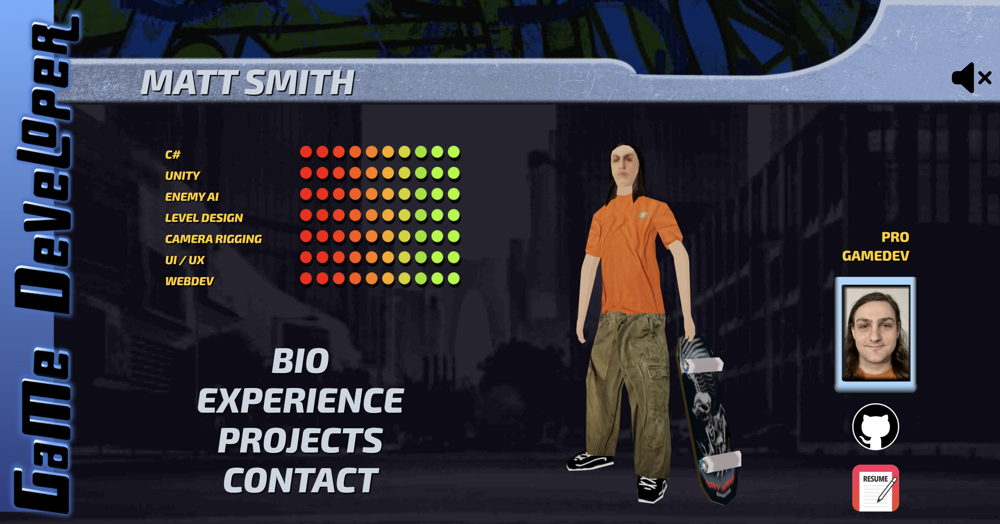
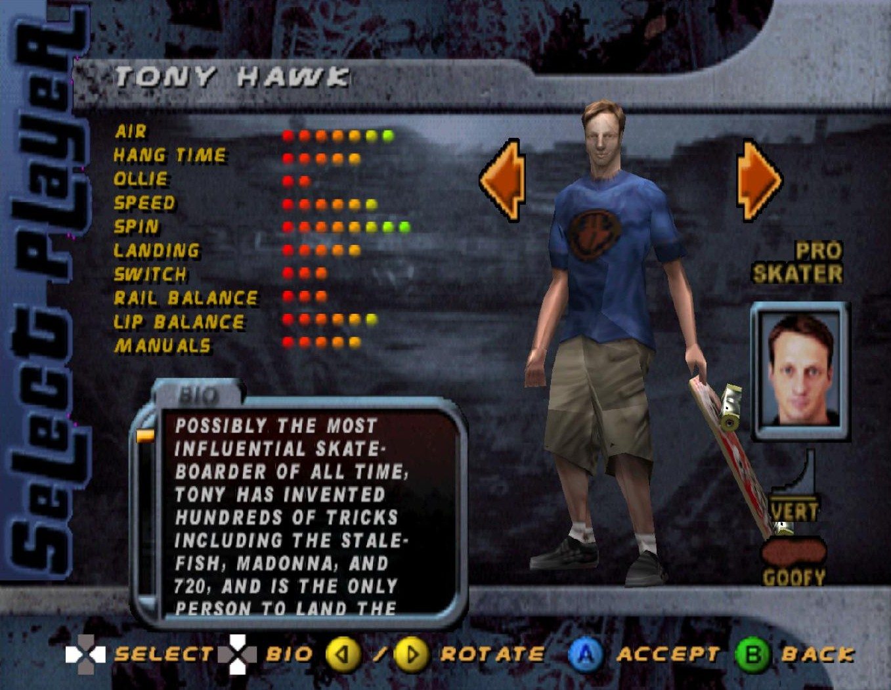

# mattsmith.digital - React + Three.js site

A portfolio website designed to mimic the Tony Hawk Pro Skater character selection screen built with React + Three.js.

## Tech Stack

- React 18
- Tailwind CSS
- Three.js
- Blender (Model creation)
- Inkscape (UI design)

## Features

- Responsive design
- Custom-built UI elements
- Interactive 3D character model + animation
- Sound effects + sound track from the game

