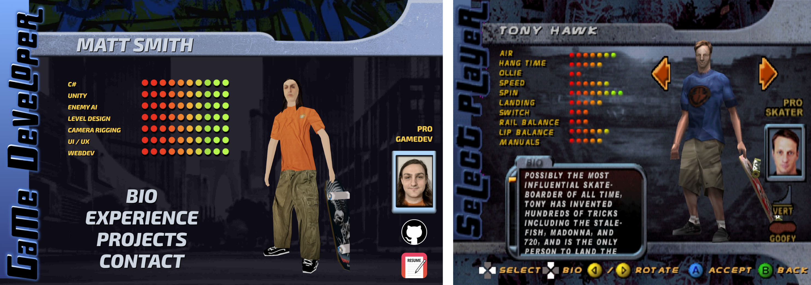

# THPS Portfolio Site - React + Three.js

A portfolio website designed to mimic the Tony Hawk Pro Skater character selection screen built with React + Three.js. This project features a responsive layout and custom-built assets (model + UI).

## Tech Stack

- React 18
- Tailwind CSS
- Three.js
- Blender (Model)
- Inkscape (UI)

## Features

- Responsive design
- Custom-made UI elements
- Interactive 3D character model + animation
- Sound effects + sound track from the game

## Design Comparison

